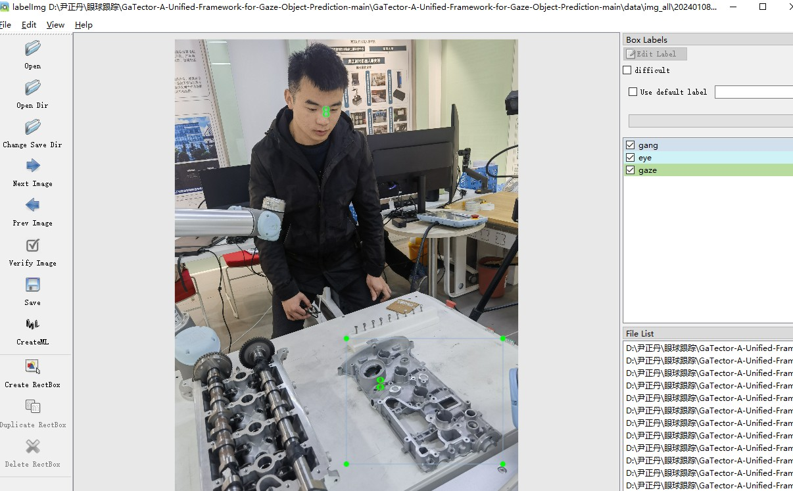
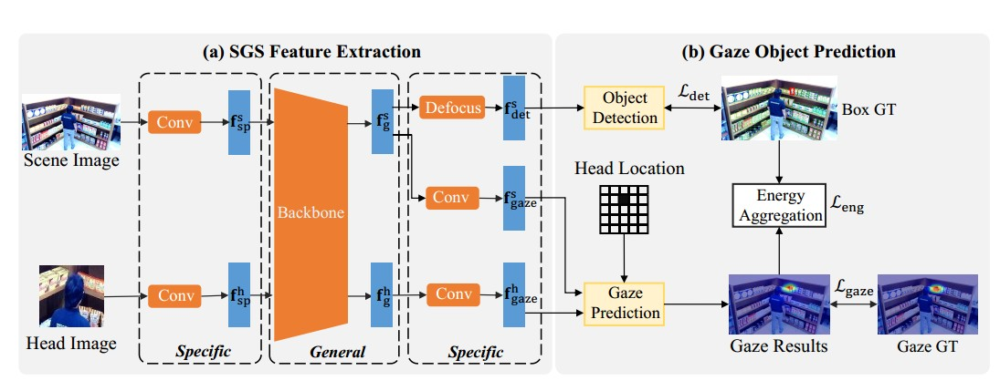

## 数据标注
基于labelImg标注数据



其中标注的数据有三组,以CreateML方式保存：
gang: 缸盖的bbox，这一坐标比较重要，需要标注准确
eye：双眼中间的点，这里只需用到标注框的左上角坐标来确定眼睛中心点，便于裁剪脸部图像
gaze: 和上面一样，用左上角坐标来大致确定看的点的，这里不需要完全准确，大致肉眼确定就行，模型训练主要依靠上面的缸盖坐标



模型结构如上，训练的时候冻结下面的eye_heatmap分支，主要训练上面的det分支

运行下面的代码训练模型
```python
python my_train.py --train_mode 0 --train_dir ./test_data/test_img_all/ --train_annotation ./test_data/test_img_all/label/test_gt.json --test_dir ./test_data/test_img_all/ --test_annotation ./test_data/test_img_all/label/test_gt.json
```

## Test:
直接运行下面的代码测试
```python
python my_test.py
```
可以在 lib/yolo.py下面的img_crop函数下修改人脸检测模型，如下
```python
mtcnn = MTCNN()
face_rect = mtcnn.detect(img)
```
